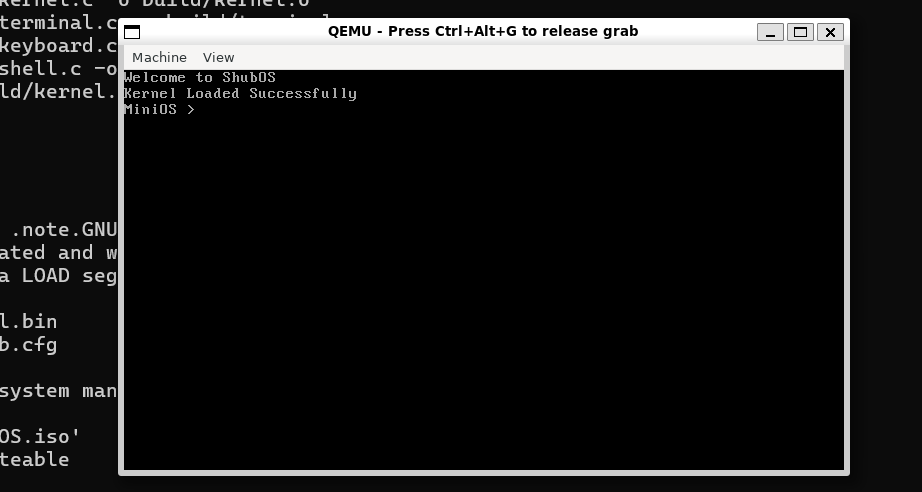
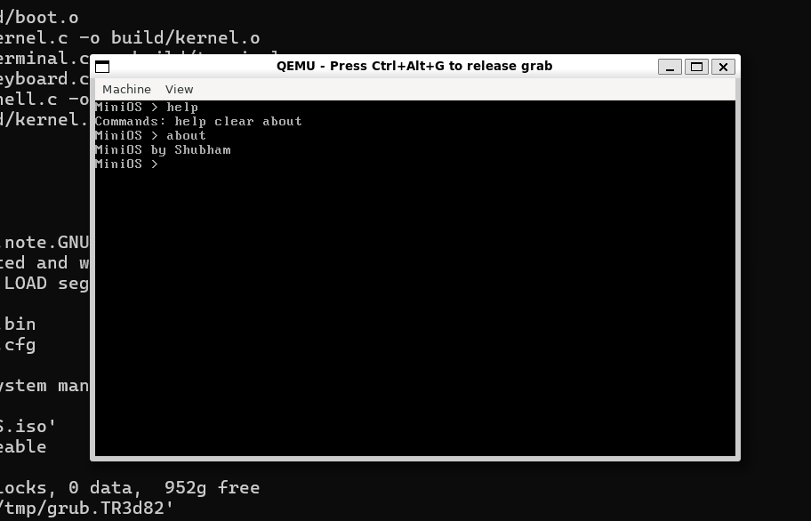

# MiniOS

A simple educational operating system kernel written in C and x86 Assembly.

## Features

* GRUB-based bootloader
* Multiboot-compliant kernel
* VGA text-mode terminal driver
* Keyboard driver using direct hardware I/O
* Interactive shell
* Command parsing and input buffering
* Backspace support
* Modular kernel architecture

## Current Commands

* help
* about
* clear

## Architecture

GRUB -> boot.asm -> kernel.c -> shell.c -> terminal.c -> VGA Memory

Keyboard -> keyboard.c -> shell.c

## Concepts Implemented

* Boot process
* Multiboot
* VGA text mode
* Port-mapped I/O
* Keyboard scancodes
* Polling-based device drivers
* Terminal abstraction
* Input buffering
* Control-character handling

# Screenshots

## Shell

## Commands

## Future Work

* Interrupt Descriptor Table (IDT)
* Interrupt-driven keyboard input
* Memory allocator
* Task scheduler
* System calls
* File system
